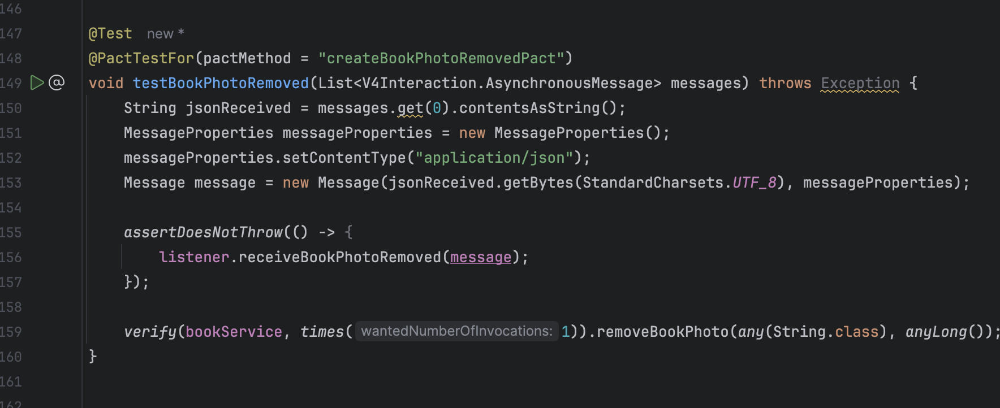

# ODSOFT24-25_1201152_1230205
Desenvolvimento do trabalho de ODSOFT 24/25

Relatório Parte 2


# Índice

- [Development of CI/CD/CD pipeline (description and argumentation)](#1-development-of-cicd-pipeline)
  - [1.1 - Development of CI/CD/CD pipeline (description and argumentation)](#11---Development-of-CI/CD/CD-pipeline)
  - [1.2 - Consumer-Driven Contract Tests](#12-pipeline-specification-read-checkout-from-scm)
  - [1.3 - Container image build](#13-build-and-package)
  - [1.4 - Container image push to repository](#14-static-code-analysis)
  - [1.5 - Deployment on the Docker service on other DEl's virtual servers (or other cloud's remote servers)
    ](#15-tests-by-type)

- [2 DDeployment process (description and argumentation)](#2-improvement-of-automated-functional-software-tests-including-not-only-coverage-but-also-quality)
  - [2.1 - Adoption of Development, Testing and Production environments](#21---unit-opaque-box-tests-domain-classes)
  - [2.2 - Deployment is decided by the human trigering the pipeline after receiving the email or other type of messa](#22---unit-transparent-box-tests-domain-classes)
  - [2.3 - Automatically roll-back each service to a previous version](#23-mutation-tests-domain-classes)
  - [2.4 - Tests are run against the container](#24---integration-tests-controller-service-domain-repository-gateways-adapters)
  - [2.5 - Acceptance tests](#25---acceptance-tests)
  - [2.6 - Scale up and down each service](#25---acceptance-tests)
  - [2.7 - Performance tests](#25---acceptance-tests)
  - [2.8 - System do not have a downtime when updating a service](#25---acceptance-tests)


## 1. Development of CI/CD/CD pipeline

### 1.1 Independent CI/CD/CD pipeline per microservice

A pipeline CI/CD/CD (Integração Contínua, Entrega Contínua e Desdobramento Contínuo) automatiza o processo de entrega de software, garantindo:

- Integração de alterações no código com frequência.
- Testes rigorosos para validação.
- Desdobramentos ágeis e sem interrupções.

**Benefícios:**

- Minimiza intervenção humana.
- Reduz erros.
- Assegura consistência no desdobramento.

### Local


## DEI


A maquina virtual do DEI estava impossivel de usar, mais de uma hora para correr uma das pipelines.

### 1.2 Consumer-Driven Contract Tests

Implementamos testes CDC para garantir a comunicação assíncrona via RabbitMQ entre serviços, focando especificamente na funcionalidade de busca de livros.

**Como fazer?**
É importante destacar que, para executar este teste, é necessário utilizar o Pact, uma ferramenta de testes de contrato que verifica as interações entre microserviços. O Pact assegura que as expectativas de comunicação entre consumidores e provedores de APIs sejam atendidas, utilizando contratos como acordos que definem como os serviços devem interagir. Isso ajuda a evitar falhas na integração entre sistemas.

Começamos por descomentar os 2 testes já existentes no ficheiro BooksCDCDefinitionTest.java.

### Definição do Contrato(Pact) 1


### Implementação do Teste


--

### Definição do Contrato(Pact) 2


### Implementação do Teste


--

### Execução e Verificação


### 1.3 Container image build


O stage, "Build Docker Image", constrói uma imagem Docker com o nome especificado pela variável ${imageName}. Dependendo do sistema operativo (Unix ou Windows), executa o comando adequado para fazer o login e construir a imagem.
```groovy
stage('Build Docker Image') {
    steps {
        dir('lms-books') {
            script {
                echo 'Building Docker image...'
                sh """
                    docker build -t ${IMAGE_NAME}:${IMAGE_TAG} .
                """
            }
        }
    }
}
```


### 1.4 Container image push to repository

Depois de a imagem estar criada, autentica o utilizador no GitHub Container Registry usando um token e, depois,  para esta ser enviada para o repositório foi utilizado. Dependendo do sistema operativo (Unix ou Windows), o comando docker push é executado para fazer o upload da imagem com o nome ${imageName}:latest para o repositório remoto. Para sistemas Unix, é utilizado o comando sh, e para Windows, o bat.
```groovy
stage('Push Docker Image') {
  steps {
    dir('lms-books') {
      script {
        withCredentials([string(credentialsId: GITHUB_TOKEN_ID, variable: 'GITHUB_TOKEN')]) {
          echo 'Pushing Docker image to registry...'
          sh """
                        docker push ${IMAGE_NAME}:${IMAGE_TAG}
                    """
        }
      }
    }
  }
}

```

### 1.5 Deployment on the Docker service on other DEI's virtual servers(or other cloud's remote servers)

O stage "Zero Downtime Deployment" garante que o deploy da aplicação ocorra sem interrupções no serviço. O processo começa com a inicialização de uma nova versão da aplicação com o Docker Compose, mas sem parar a versão atual. 
Após isso, é realizada uma verificação de saúde na nova versão. Se tudo estiver bem, a versão antiga é removida e a nova versão passa a ser a ativa.
Caso a nova versão falhe na verificação, ela é desfeita e o deploy é interrompido e sistema continua em operação sem downtime.
Essa abordagem assegura uma transição suave e contínua para a nova versão.

```groovy
stage('Zero Downtime Deployment') {
           steps {
               dir('lms-books') {
                   script {
                       echo 'Starting Zero Downtime Deployment...'


                       sh """
                           docker-compose -f docker-compose-prod.yml -p new_version up -d --build
                       """
                       def success = sh(script: "curl -f http://localhost:${SERVER_PORT}/health", returnStatus: true) == 0
                       if (!success) {
                           sh """
                               docker-compose -f docker-compose-prod.yml -p new_version down
                           """
                           //error('Deployment failed.')
                       }

                       echo 'Switching to the new version...'

                       sh """
                           docker-compose -f docker-compose-prod.yml -p old_version down --remove-orphans
                           docker-compose -f docker-compose-prod.yml -p new_version up -d
                       """

                       echo 'Deployment completed with zero downtime!'
                   }
               }
           }
       }
````


Foram identificados problemas no servidor virtual da DEI, como a ausência do Docker. O problema foi resolvido com a instalação do plugin Docker no Jenkins e depois de adicionar o jenkings ao grupo de utilizadores docker.


--

Dentro do localhost:8080, os deploys foram realizados sem problemas.

Books


---
Users


## 2. Deployment process

### 2.1 Adoption of Development, Testing and Production environments

Para suportar a utilização de diferentes ambientes, foram criados três arquivos: 
- docker-compose-development.yml, 
- docker-compose-testing.yml 
- docker-compose-production.yml.

Cada um desses arquivos contém configurações específicas para o ambiente correspondente, como as portas a serem utilizadas, evitando assim qualquer conflito entre eles.

Esses três arquivos são baseados na configuração do arquivo principal docker-compose.yml.

O processo de deploy ocorre em três etapas: desenvolvimento (dev), testes (test) e produção (prod). Em cada etapa, o sistema realiza o deploy, executa os testes e, ao final, solicita uma confirmação para avançar para o próximo ambiente (seguindo a sequência: dev → test → prod).

### Mostrar os ficheiros


### 2.2 Deployment is decided by the human trigering the pipeline after receiving the email or other type of messag

Neste stage, o deploy para o ambiente de produção só ocorre após a aprovação do utilizador. O processo é feito da seguinte forma:

1. **Solicitação de Aprovação**:  
   O stage exibe uma mensagem perguntando ao utilizador se ele aprova o deploy para o ambiente de produção.

2. **Parâmetro de Aprovação**:  
   O utilizador tem a opção de aprovar ou negar o deploy, sendo apresentado um parâmetro booleano com a opção *"Sim"* (verdadeiro) ou *"Não"* (falso). O valor padrão é `false` (não aprovado).

3. **Armazenamento da Decisão**:  
   Após o utilizador responder, a decisão é armazenada na variável `DEPLOYMENT_APPROVED`, que será configurada como `true` se o utilizador aprovar o deploy e `false` caso contrário.

O código abaixo mostra como isso é feito no pipeline:

```groovy
stage('Approval to Deploy to Production Environment') {
    steps {
        input message: 'Approve deploy to Prod?', parameters: [
            booleanParam(defaultValue: false, description: 'Approve deploy?', name: 'DeployApproval')
        ]
        script {
            DEPLOYMENT_APPROVED = params.DeployApproval
        }
    }
}
```

Jenkins


---
BlueOcean


### 2.3 Automatically roll-back each service to a previous version

O **rollback automático** permite restaurar uma versão anterior de um serviço em caso de falha após a implementação de uma nova versão. Quando um teste falha, a pipeline executa automaticamente o rollback, garantindo a continuidade do sistema sem interrupções, voltando à versão anterior estável.

#### Como funciona na pipeline:

1. A falha nos testes (Desenvolvimento, Testes ou Produção) é detetada.
2. A função `rollback(env)` é chamada para reverter para a versão anterior no ambiente correspondente.
3. O processo é feito automaticamente sem necessidade de intervenção manual, minimizando o tempo de inatividade.

```groovy
def rollback(env) {
    echo "A reverter para a versão anterior no ambiente ${env}..."
    if (env == 'dev') {
        sh """
            docker-compose -f docker-compose-dev.yml down --remove-orphans
            docker-compose -f docker-compose-dev.yml up -d --force-recreate
        """
    } else if (env == 'test') {
        sh """
            docker-compose -f docker-compose-test.yml down --remove-orphans
            docker-compose -f docker-compose-test.yml up -d --force-recreate
        """
    } else if (env == 'prod') {
        sh """
            docker-compose -f docker-compose-prod.yml down --remove-orphans
            docker-compose -f docker-compose-prod.yml up -d --force-recreate
        """
    }
    echo "Rollback concluído no ambiente ${env}."
}
```


### 2.4 Tests are run against the container

O stage "Run Tests Against Container" tem como objetivo executar os testes dentro de um ambiente de container.
Inicialmente, ele define o endereço do container com a variável SERVER_PORT, que especifica a porta em que o container pode ser acessado.
Depois, o Maven é utilizado para executar os testes e passa esse URL como parâmetro para assegurar que os testes são feitos no ambiente dentro do container. 
Este processo garante que a aplicação funcione corretamente nesse contexto específico, validando a qualidade e a estabilidade do sistema antes da sua implantação.

```groovy
 stage('Run Tests Against Container') {
            steps {
                dir('lms-books') {
                    script {
                        sh """
                            ${MAVEN_HOME}/bin/mvn verify -Dtest.container.url=http://localhost:${SERVER_PORT}
                        """
                    }
                }
            }
        }
```

### 2.5  Scale up and down each service

O stage "Scale Up and Scale Down" permite ajustar o número de instâncias de serviços, ou seja, aumentar ou diminuir a quantidade de instâncias de serviços específicos, como book_1, book_2 e users. Primeiramente, o estágio pede ao utilizador para fazer uma escolha através da função input, onde ele decide se quer aumentar ("Scale Up") ou diminuir ("Scale Down") o número de instâncias e define a quantidade para cada serviço.

Se o utilizador optar por "Scale Up", o estágio utiliza o comando docker-compose para iniciar novas instâncias dos serviços com o número de instâncias especificado. Se a escolha for "Scale Down", o comando docker-compose reduz as instâncias para 0, parando esses serviços.

No caso da pipeline dos users, que está ligada ao RabbitMQ e ao PostgreSQL, é adicionado um comando para garantir que o RabbitMQ e a base de dados sejam iniciados novamente, evitando a perda de dados. Este processo permite ajustar a capacidade dos serviços conforme necessário, otimizando os recursos e garantindo a escalabilidade do sistema.

```groovy
 stage('Scale Up and Down Services') {
            steps {
                script {
                    def scaling = input(
                        message: 'Specify scaling action and instances for book01 and book02:',
                        parameters: [
                            choice(
                                choices: ['Scale Up', 'Scale Down'],
                                description: 'Choose whether to scale up or scale down the services.',
                                name: 'scaleAction'
                            ),
                            string(
                                defaultValue: '1',
                                description: 'Number of instances for book01',
                                name: 'scaleBook01'
                            ),
                            string(
                                defaultValue: '1',
                                description: 'Number of instances for book02',
                                name: 'scaleBook02'
                            )
                        ]
                    )

                    echo "Scaling action: ${scaling.scaleAction}"
                    echo "Scaling services: scaleBook01=${scaling.scaleBook01}, scaleBook02=${scaling.scaleBook02}"

                    dir('lms-books') {
                        echo "Scaling down existing services..."
                        sh """
                            docker-compose -f docker-compose-test.yml down --remove-orphans
                        """

                        if (scaling.scaleAction == 'Scale Up') {
                            echo "Scaling up services..."
                            sh """
                                docker-compose -f docker-compose-test.yml up --scale scaleBook01=${scaling.scaleBook01} --scale scaleBook02=${scaling.scaleBook02} -d
                            """
                        } else if (scaling.scaleAction == 'Scale Down') {
                            echo "Scaling down services..."
                            sh """
                                docker-compose -f docker-compose-test.yml up --scale scaleBook01=0 --scale scaleBook02=0 -d
                            """
                        }
                    }
                }
            }
        }
```


### 2.6 Performance test

Para a realização dos testes de Jmeter, o mesmo necessita de autenticar-se na aplicação, ou seja, necessita de um login. Para isso foi criado um token com credencias da aplicação, onde o Bearer é obtido através do Swagger-ui.

### Teste de Stress

Este teste coloca o sistema sob uma carga superior à sua capacidade máxima, com o objetivo de identificar os limites do sistema e entender como ele se comporta diante de falhas ou sobrecarga. O teste de Stress ajuda a avaliar a estabilidade da aplicação em condições extremas.

### Teste de Carga (Load)

Neste teste, o desempenho da aplicação é analisado sob uma carga de trabalho normal ou esperada, simulando o tráfego diário para garantir que o sistema mantém um bom desempenho sem degradação.

---

### Autenticação no JMeter

Antes de realizar os testes no JMeter, é necessário autenticar na aplicação, ou seja, fazer login. Para isso, foi gerado um **token** com credenciais da aplicação, que foi obtido via **Swagger-ui** e utilizado no JMeter para autenticação.


---

### Teste "GetAuthorByName"

Este teste verifica o desempenho da pesquisa de um autor pelo nome "Ricardo Queirós".

#### Stress

Os resultados mostraram que o sistema teve um bom desempenho durante o teste de Stress. Com 2000 solicitações, não houve erros e os tempos de resposta foram consistentes, com uma média de 159 ms. A taxa de transferência foi de 382,5 pedidos por segundo, e o sistema demonstrou boa estabilidade.


#### Carga (Load)

Este teste de carga revelou problemas, pois, apesar de ter processado 261.015 solicitações, a taxa de erro foi de 67%, o que significa que a maior parte das solicitações falhou. O tempo médio de resposta foi de 74 ms, mas a alta taxa de falhas indica que o sistema não está preparado para lidar com um número elevado de requisições.


---

### Teste "PostAuthor"

Este teste verificou a criação de um autor com o nome "Fernando Pessoa" e a biografia "Fino ou Imperial".

#### Stress

O teste de Stress, com 2000 solicitações, mostrou uma melhoria em relação ao teste anterior, mas ainda existem problemas a serem resolvidos. A taxa de erro foi de 0% e os tempos de resposta apresentaram uma média de 1.912 ms, com variação significativa. A alta variabilidade dos tempos de resposta indica que o sistema pode ter problemas de alocação de recursos ou processamento.


#### Carga (Load)

Neste teste de carga, a taxa de erro foi de 67%, o que é um indicador de que o sistema não consegue processar a maioria das requisições corretamente sob carga. Esse é um problema sério que precisa ser resolvido para garantir o bom funcionamento da aplicação.


### 2.7 System do not have a downtime when updating a service

Este requisito significa que o sistema deve continuar disponível para os utilizadores enquanto um serviço está a ser atualizado. Para alcançar isso, são utilizadas estratégias que garantem que as atualizações não causem interrupções. No exemplo fornecido, foi implementado um processo de **Zero Downtime Deployment** usando Docker Compose.

### Etapas do Pipeline

No pipeline foi adicionado um stage chamado `Zero Downtime Deployment`. Este utiliza uma abordagem baseada em Blue-Green Deployment para garantir que a nova versão do serviço está funcional antes de ser colocada em produção.

```groovy
stage('Zero Downtime Deployment') {
    steps {
        dir('lms-books') {
            script {
                echo 'Starting Zero Downtime Deployment...'

                // Criação de um novo ambiente com a nova versão
                sh """
                    docker-compose -f docker-compose-prod.yml -p new_version up -d --build
                """
                
                // Verifica se a nova versão está saudável
                def success = sh(script: "curl -f http://localhost:${SERVER_PORT}/health", returnStatus: true) == 0
                if (!success) {
                    sh """
                        docker-compose -f docker-compose-prod.yml -p new_version down
                    """
                    //error('Deployment failed.')
                }

                echo 'Switching to the new version...'

                // Finaliza a versão antiga e ativa a nova versão
                sh """
                    docker-compose -f docker-compose-prod.yml -p old_version down --remove-orphans
                    docker-compose -f docker-compose-prod.yml -p new_version up -d
                """

                echo 'Deployment completed with zero downtime!'
            }
        }
    }
}
```
### Etapas do Processo:

1. **Criar Nova Versão**:
   - Utiliza o comando `docker-compose` para criar e iniciar uma nova versão do serviço (identificada como `new_version`).
   - Garante que a nova versão é construída e está funcional antes de ser ativada.

2. **Verificar Saúde do Serviço**:
   - O sistema verifica se a nova versão está a funcionar corretamente, enviando um pedido ao endpoint `/health`.
   - Se a nova versão não for saudável, o processo é revertido.

3. **Trocar para a Nova Versão**:
   - O ambiente da versão antiga (`old_version`) é encerrado.
   - A nova versão é ativada, tornando-se o ambiente principal de produção.


---


O ficheiro docker-compose.yml define os serviços e a configuração necessária para suportar o Zero Downtime Deployment. Ele inclui a lógica para criar múltiplas versões do mesmo serviço (ex.: book01 e book01_new).
Criar Versões Paralelas:


A configuração suporta duas versões:
A versão antiga em produção (book01).
A nova versão (book01_new) usada para validação antes de entrar em produção.


Verificar Saúde da Nova Versão:
É configurado um healthcheck para monitorar continuamente a saúde do serviço.
O sistema só troca para a nova versão após garantir que ela está estável.


Gerir Réplicas:
Utiliza múltiplas réplicas para melhorar a disponibilidade e reduzir o risco de falhas durante o deployment.


```groovy
version: '3'
services:
  book01:
    image: lmsbooks:latest
    ports:
      - "7073-7076:8080"  
    environment:
      SPRING_PROFILES_ACTIVE: instance1,bootstrap,prod
    networks:
      - lms_network
    volumes:
      - "uploaded_files_volume_1:/tmp"
    deploy:
      replicas: 2
    privileged: true

  book01_new:
    image: lmsbooks:latest
    ports:
      - "7081-7084:8080" 
    environment:
      SPRING_PROFILES_ACTIVE: instance1_new,bootstrap,prod
    networks:
      - lms_network
    volumes:
      - "uploaded_files_volume_3:/tmp"
    deploy:
      replicas: 2
      restart_policy:
        condition: on-failure
    privileged: true
    healthcheck:
      test: ["CMD", "curl", "-f", "http://localhost:8080/health"]
      interval: 30s
      timeout: 10s
      retries: 3

networks:
  lms_network:
    external: true

volumes:
  uploaded_files_volume_1:
  uploaded_files_volume_2:
  uploaded_files_volume_3:
```